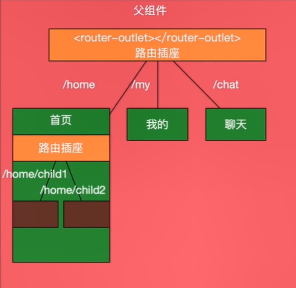

# Angular8

为什么选择 angular：

- 项目层面
  - 运用 rxjs 做逻辑处理异步处理十分自然，表单的约束验证，文件结构、编码规范
- 生态层面
  - 背后靠着 Google、Microsoft（typescript、rxjs）
  - Linkedin 上该技术栈招聘需求最多

内容分布：

- 环境搭建
- 开发工具
- 工程结构
- 可滚动的 Tabbar
- 组建的写法
- 样式绑定
- 事件绑定
- 组件的输入输出
- 基础知识
  - 生命周期
  - 引用模板
  - 模块概念
  - 模块划分
  - 双向绑定
  - 轮播图组件
- 进阶知识
  - 注解
  - 指令
  - 组件嵌套
  - 路由
  - 组件投影
  - 依赖注入
  - 脏值检测
  - 望各组件
- HTTP 通讯
  - HTTP 概念
  - 消息
  - 调试
  - Rest API
  - HttpClient
  - 拦截器
  - RxJS
- 项目实战
  - 商品列表组件
  - 商品详情组件
  - 拼单组件
  - 确认订单
  - 对话框
  - 个人信息组件
- 上线部署
  - 懒加载
  - 环境变量
  - 编译打包
  - 部署
  - 总结
  
## 框架对比

### Angular8 VS AngularJS

AngularJS：

- 开发语言为 JavaScript
- 采用不同的指令进行数据和事件绑定
- 可扩展性差，在复杂应用上维护性差

Angular8 的优点：

- TypeScript 提供类型检查和代码提示
- 采用`[]`进行数据绑定，`()`事件绑定
- 优异的可扩展性，可维护性
  
### vs React

Angular 是一个完整的框架，而 React 是一个类库，其对应Angular的各种特性，需要寻找各种开源社区类库，如下表所示。

Angular使用HTML+CSS+组件类，而 React 中所有都是js

### vs Vue

- vue 很多思想脱胎于angularjs，和react类似是一个轻量级的，面向view层的类库
- vue适合快速开发较小的工程，而angular自带编程范式，使得它成为与多个开发人员合作的好选择
- vue 是个人开发维护的开源项目，而angular是Google的开源项目

### angular 架构


## 环境搭建

Node、npm/cnpm、angular cli。

```shell
npm install -g @angular/cli
ng version
```

## VSCode 配置

推荐插件：angular files、angular language Service、Angular Snippets

chrome插件：augury

## angular cli

创建项目：

```shell
ng new <项目名>

# 跳过安装，只创建文件
ng new <项目名> --skip-install --style css --routing false
```

启动开发服务器：

```shell
ng serve
```

### 项目目录结构


### 首页组件结构

- 组件控制屏幕的一部分视图
- 组件的逻辑是定义在 Class 中的，Class 通过属性和方法与视图交互
- `@Component` 注解标记一个 Class 为 Angular Component
- `@Component` 中的 templateUrl 或者 template 将模板和组件联系起来
- `@Component` 中的 styleUrls 或者 styles 将样式和组件联系起来
- 模板样式和组件一起决定视图的外观和行为

### 什么是组件


### emmet 快捷用法

<https://docs.emmet.io/cheat-sheet>

### 真机调试

- 确保手机和电脑处于同一 wifi
- `ng serve --host 0.0.0.0`
- 手机浏览器打开 `http://<电脑IP>:4200`

消除滚动条：

```css
::-webkit-scrollbar {
  display: none;
}
```

### 重要指令-ngFor

- 变量的应用范围
- 索引的获取
- 第一个和最后一个
- 奇和偶
- 提升性能 trackBy

### 事件的处理和样式绑定

- `[class.样式类名]="判断表达式"`是在应用单个 class 时常用的技巧
- 使用方括号是数据绑定，如果带方括号，等号后买你就是一个对象或表达式
- 不使用方括号，等号后面angular认为是一个字符串，但如果我们此时在等号后面使用`{{}}`就是和方括号等效的
- 圆括号用于事件绑定，等号后可以接表达式也可以是一个定义在类中的函数

### 封装第一个组件

组件封装的意义和方法：

- 需要重用，或者简化逻辑
- ng generate component 组件名（驼峰形式）
- 使用 index.ts 方便导入以及隔离内部变化对外部的影响

### 样式绑定的几种方式

- `[class.className]="条件表达式"`
- `[ngClass]="{'One': true, 'Two': true, 'Three': false}"`
- `[ngStyle]="{'color': someColor, 'font-size': fontSize}"`

## 组件的生命周期

- constructor 构造函数永远首先被调用
- ngOnChanges 输入属性变化时被调用
- ngOnInit 组件初始化时被调用
- ngDoCheck 脏值检测时调用
  - ngAfterContentInit 当内容投影 ng-content 完成时调用
  - ngAfterContentChecked Angular 检测投影内容时调用（多次）
  - ngAfterViewInit 当组件视图（子视图）初始化完成时
  - ngAfterViewChecked 当检测视图变化时（多次）
- ngOnDestroy 当组件销毁时

## 在组件类中引用模版


## 模板在组件类中的引用

引用多个模板元素：
可以使用`@ViewChildren`，在 `@ViewChildren`中可以使用引用名或者使用 Angular 组件/指令的类型。声明类型为`QueryList<?>`

## @ViewChild 总结

- @ViewChild 用来在类中引用模板中的视图节点
- 可以说 Angular 组件，也可以是HTML元素
- 在 AfterViewInit 中可以安全的使用 @ViewChild 引用的元素
- 推荐使用 Renderer2 操作 DOM 元素

## 轮播组件

`scroll-behavior: smooth;`: 轮播图的过渡效果  
`-webkit-overflow-scrolling: touch;`：触摸可滚动  
`scroll-snap-type: x mandatory;`：在 x 轴强制吸附效果  
`scroll-snap-align: start;`：吸附的位置在起始位置  

## 双向绑定

就是属性绑定+事件绑定

```html
<input [value]="username" (input)="username = $event.target.value" />
```

`[value]="username"` -- 绑定 username 值到input的value  
`(input)="表达式"` -绑定表达式到 input的input事件  
`username = $event.target.value`- 在input事件触发时执行  
$event 表达式，提供事件的数据

### ngModel

FormsModule 中提供的指令  
使用`[(ngModel)]="变量"`形式进行双向绑定  
其实是一个语法糖  
`[ngModel]="username" (ngModelChange)="username=$event"`

## 模块

模块就是提供相对独立功能的一组代码

- 模块的组成部分可以有：组件、服务、指令、管道等
- 从某种角度说，它像一个小型应用

- @NgModule 注解
  - Imports 依赖的其它模块
  - Exports 自己模块暴露的东西，导出的可以是模块也可以是指令
  - Providers 对自己模块内部要暴露哪些服务，依赖注入
  - Declarations 我这个模块里面有哪些组件，不能是模块，只能是组件、指令和管道。注意每个组件/指令/管道只能在一个模块中声明
  - bootstrap：跟模块
  - BrowserModule：在跟模块需要引入，里面导出了 CommonModule、ApplicationModule

### 模块的“坑”

- 导入其它模块时，需要知道使用该模块的目的
  - 如果是组件，那么需要在每一个需要该组件的模块都进行导入
  - 如果是服务，那么一般来说在跟模块中导入一次即可
- 需要在每个需要的模块中导入的
  - CommonModule: 提供绑定、*ngIf 和 *ngFor 等基础指令，基本上每个模块都需要导入它
  - FormsModule/ReactiveFormsModule：表单模块需要在每一个需要的模块导入。
  - 提供组件、指令或管道的模块
- 只在跟模块导入一次的
  - HttpClientModule/BrowserAnimationsModule/NoopAnimationsModule
  - 只提供服务的模块

### 如何有效的组织模块


实际项目中会有一个 Common 模块替代跟模块的作用，包含很多跟模块的功能，而跟模块只做一个引导作用。

### 创建模块

```shell
ng g m Home --routing
```

## 注解

### 什么是装饰器（注解）

装饰器/注解就是一个函数，但它是一个返回函数的函数，它是ts 的一个特性。

自己的装饰器建立在 shared 目录下的 decorators 目录。

## 指令


### 内建指令

结构型指令：ngIf、ngFor、ngSwitch  
属性型指令：ngClass、ngStyle、ngModel

自己的指令文件建立在 shared 目录下的 directives 目录。

指令所在的元素叫宿主。  

指令和组件的区别：  
指令：我不太在意用的div也好什么也好无所谓，但是我可以改变你自己的行为。  
指令可以理解为没有模板的组件，它需要一个宿主元素

### 指令的样式绑定和事件绑定

指令没有模板，指令要寄宿在一个元素之上 - 宿主（Host）  
`@HostBinding`绑定宿主的属性或者样式。  
`@HostListener`绑定宿主的事件。  
组件的样式中也可以使用`:host`这样一个伪类选择器代表宿主元素。

## 组件嵌套


避免组件嵌套导致冗余数据和事件传递：  

- 内容投影
- 路由
- 指令
- 服务

## 投影组件

投影组件的可定制化自由度比较大，但是这不意味着说比一般组件要好，它对组件的控制力要弱

### ng-content 是什么

简单回答：动态内容

### 表现形式

`<ng-content select="样式类/HTML标签/指令"></ng-content>`

### 适用场景

- 动态内容
- 容器型组件

## 路由


### 路由定义


跟路由下的组件必须在 `app.module.ts`中 imports 添加。

### 子路由



angular 提供动态路由，定义路径变量path。

### 路径参数


### 路径对象参数


### 查询参数


## 管道

管道的作用就是在视图上提供便利的值变换的方法

在 home-grand 组件实现了一个自定义管道

4-13
